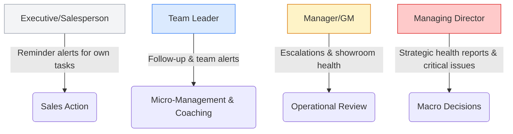
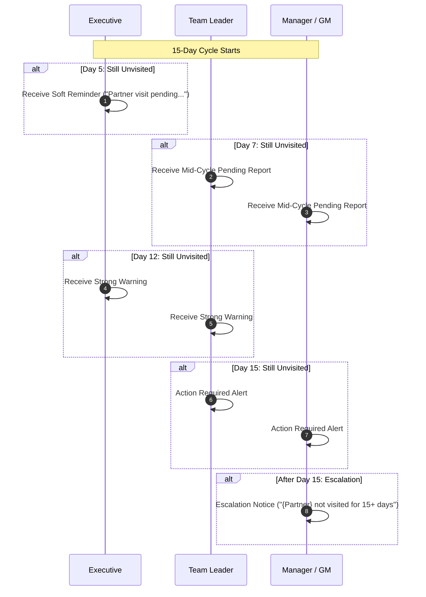

# Art 'N' Glass Notification & Smart Alerts Framework
### Management Reference Document & System Architecture

This document outlines the official design, rules, criteria, and workflow logic for the Art 'N' Glass mobile notification system. The system is designed to drive sales discipline, improve lead conversion, and prevent customer neglect while keeping notification frequency clean and non-intrusive (no Swiggy/Zomato style spam).

---

## 1. High-Level Core Philosophy
The notification framework operates on a simple, hierarchy-based workflow:



* **Executives** receive action-oriented alerts for their own tasks.
* **TLs** receive follow-up triggers when executives miss targets or timelines.
* **Managers/GMs** receive showroom health summaries and escalations for unresolved red cases.
* **MD** receives high-level health indices and major red alerts only.

---

## 2. Notification Levels & Trigger Messages

### Level 1: Executive / Salesperson
* **Goal**: Focus solely on personal tasks, pipelines, and local achievements.
* **Frequency**: Max 1–2 highly actionable notifications per day.

| Notification | Trigger Condition | Message Template |
| :--- | :--- | :--- |
| **Partner Visit Pending** | Active partner not visited in the 15-day cycle | *“Gentle reminder: aapke {count} partner visits pending hain. Please complete before deadline.”* |
| **Daily/Weekly Visit Low** | Average visit frequency falls below 2.5 per day | *“Aapki visit average low hai. Please maintain minimum 2.5 visits/day.”* |
| **Client Addition Low** | 0 to 2 clients added in a calendar week | *“This week client addition low hai. Please add new client opportunities.”* |
| **Workscope Addition Low**| 0 to 3 workscope entries added in a week | *“Workscope addition low hai. Please update pending opportunities.”* |
| **Inactivity Alert** | 2 consecutive days with no visits or system updates | *“Aapne 2 din se koi visit/update nahi kiya. Please update your activity.”* |
| **Leaderboard Update** | Weekly / Monthly ranking announcement | *“You are currently rank #{rank} in visits this week. Keep going!”* |
| **Winner Recognition** | Earning the weekly/monthly top performer slot | *“Congratulations! You are this week’s top performer.”* |

---

### Level 2: Team Leader (TL)
* **Goal**: Enable active monitoring of team compliance without checking reports daily.
* **Frequency**: Daily action summary + urgent team alerts.

| Notification | Trigger Condition | Message Template |
| :--- | :--- | :--- |
| **Team Member Inactive** | Any executive has no system activity for 2 days | *“{Employee_Name} has no activity for 2 days. Please follow up.”* |
| **Partner Visit Pending** | Cumulative team partners pending for the cycle | *“Your team has {count} partner visits pending in this cycle.”* |
| **Low Visit Average** | Any team member's average drops below 2.5 visits/day | *“{count} team members have low visit average. Action required.”* |
| **Client Addition Low** | Any executive has zero client additions during the week | *“{count} executives have zero client addition this week.”* |
| **Workscope Low** | Executives with low workscope updates | *“Workscope updates are low for {count} team members.”* |
| **Team Action Required** | Compilation of pending red alerts for the team | *“Team Action Required: {inactive} inactive, {pending} partner visits pending, {low_client} low client additions.”* |
| **Team Leaderboard** | Weekly/Monthly performance highlight of the team | *“Top performer this week: {Name} — {visits} visits, {clients} clients, {wos} workscope.”* |

---

### Level 3: Manager / General Manager (GM)
* **Goal**: Provide summary reviews, escalations, and showroom performance metrics.
* **Frequency**: Weekly showroom report + escalated red alerts only.

| Notification | Trigger Condition | Message Template |
| :--- | :--- | :--- |
| **Weekly Team Report** | Triggered every Monday morning | *“Weekly Report: {Showroom} team avg visit {avg}, partner coverage {cov}%, {red} red alerts.”* |
| **Partner Coverage Alert** | Triggered on the 7th day / mid-cycle | *“Partner Visit Alert: {count} partners pending in this cycle.”* |
| **Low Showroom Performance**| Average showroom visits fall below target (< 2.5) | *“{Showroom} showroom visit average is below target.”* |
| **Inactive Employees Summary**| 2 or more active executives remain inactive for 2+ days | *“{count} employees have no activity for 2+ days.”* |
| **Growth Low Summary** | Client & workscope addition falls below weekly showroom benchmarks | *“Client and workscope addition below weekly benchmark.”* |
| **Best/Weak Showroom** | Weekly/Monthly comparison report | *“Best showroom: {Best_Showroom}. Weak showroom: {Weak_Showroom}.”* |
| **Action Required Summary** | Active red cases in the showroom requiring GM review | *“Action Required: {count} red cases need review.”* |

---

### Level 4: Managing Director (MD)
* **Goal**: High-level showroom health and critical operational blockages.
* **Frequency**: Weekly summary + major red alerts.

---

## 3. Executive Criteria & Benchmarks

To establish uniform performance colors (Red / Yellow / Green) across the app, the system checks activities against the following benchmarks:

| Performance Metric | Red (Critical Alert) | Yellow (Needs Attention) | Green (Healthy) | Ideal Target |
| :--- | :--- | :--- | :--- | :--- |
| **Visit Average** | $< 2.0$ per day | $2.0 - 2.5$ per day | $> 2.5$ per day | **3.0** per day |
| **Client Added / Week** | $0 - 2$ clients | $3$ clients | $4+$ clients | **4+** clients |
| **Workscope Added / Week**| $0 - 3$ items | $4 - 5$ items | $5+$ items | **5+** items |
| **Partner Visit Cycle** | Pending after 15 days | Pending on days 6–14 | 100% Covered | **100% Covered** |
| **System Inactivity** | 2 days without entries | — | Active daily updates | **Active daily** |

---

## 4. Operational Workflows & Escalation Rules

### A. 🤝 Partner Visit Logic (15-Day Cycle)
Every active partner must be visited at least once every 15 days.



---

### B. 🚦 Inactivity Workflow
If an executive fails to register any activity (visits, client creation, WOS updates, check-ins), the escalation path triggers:

```
[Day 2: No Activity] ──> Executive Reminder Alert
[Day 3: No Activity] ──> Team Leader Alert ("Follow up with Executive")
[Day 5: No Activity] ──> Manager / GM Escalation Alert
```

---

## 5. Smart "Action Required" Dashboard Section

To avoid hunting through logs, the Manager and TL dashboards will feature a dedicated **Action Required** section. This section strictly displays **Red (Problem) Cases**:

* **Inactive Employees**: Shows list of inactive users (e.g., *Rizvi — 3 days inactive*).
* **Partner Visit Pending**: Mapped partners nearing/past the 15-day limit.
* **Low Visit Average**: Executives averaging less than 2.0 visits per day.
* **Client / WOS Deficit**: Team members with zero uploads for the current week.
* **Weak Showrooms**: Showrooms whose cumulative metrics have fallen to Red.
* **Pending Order Closure**: Projects marked as won where closing updates are pending.

> [!TIP]
> **Actionability**: Every item in this list is clickable. For example, clicking "3 employees inactive" expands a drill-down list showing exactly who, their showroom, and their last active date for quick calling or follow-up.

---

## 6. Implementation Phases

```
┌────────────────────────────────────────────────────────┐
│ Phase 1: Core Discipline (Must Have)                   │
├────────────────────────────────────────────────────────┤
│ • Executive inactivity tracking                        │
│ • Partner visit 15-day cycle alerts                    │
│ • Client & Workscope low alerts                        │
│ • "Action Required" dashboard red alert section        │
└──────────────────────────┬─────────────────────────────┘
                           │
                           ▼
┌────────────────────────────────────────────────────────┐
│ Phase 2: Team Motivation (Good to Have)                │
├────────────────────────────────────────────────────────┤
│ • Leaderboard ranking change notifications             │
│ • Weekly/Monthly showroom top performer highlight     │
│ • Showroom comparison badge reports (Best/Weak)        │
└──────────────────────────┬─────────────────────────────┘
                           │
                           ▼
┌────────────────────────────────────────────────────────┐
│ Phase 3: Advanced Optimization (Predictive)            │
├────────────────────────────────────────────────────────┤
│ • Automated Daily Activity Report (DSR) generation     │
│ • Machine learning predictive alerts for deal dropouts  │
│ • Custom weighted scoring variables per showroom       │
└────────────────────────────────────────────────────────┘
```

---
*End of Document. Approved for management review.*
